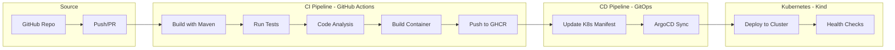

# CI/CD Pipeline Implementation Plan

Production-grade CI/CD pipeline for Task Manager using GitHub Actions, Kind (Kubernetes), and ArgoCD with GitOps principles.

## User Review Required

> [!IMPORTANT]
> **GitHub Container Registry (GHCR) vs Docker Hub**: The plan uses GHCR for container images as it integrates seamlessly with GitHub Actions. Confirm this is acceptable.

> [!WARNING]
> **SonarCloud vs CodeQL**: Two options for code analysis:
> - **CodeQL** (recommended): Free, built into GitHub, no external account needed
> - **SonarCloud**: More comprehensive but requires SonarCloud account setup

---

## Ignore File Fixes

### `.gitignore` Issues Found

| Line | Current | Problem | Fix |
|------|---------|---------|-----|
| 36-38 | `.mvn/`, `mvnw`, `mvnw.cmd` | **Critical**: Excludes Maven wrapper needed for CI builds | Remove these lines |

The Maven wrapper (`mvnw`, `mvnw.cmd`, `.mvn/`) **must be committed** to Git so CI/CD can build without requiring Maven pre-installed.

### `.dockerignore` - ✅ OK
Current configuration is appropriate for Docker builds.

---

## Pipeline Architecture



---

## Proposed Changes

### Component 1: Repository Preparation

#### [MODIFY] .gitignore
Remove Maven wrapper exclusions (lines 36-38):
```diff
-### Maven ###
-.mvn/
-mvnw
-mvnw.cmd
+### Maven ###
+# Keep Maven wrapper tracked for CI/CD
```

---

### Component 2: GitHub Actions Workflows

#### [NEW] .github/workflows/ci.yml
Main CI workflow with stages:
1. **Build**: Compile with Maven, cache dependencies
2. **Test**: Run unit tests, generate reports
3. **Analysis**: CodeQL security scanning
4. **Container**: Build and push to GHCR
5. **Update Manifest**: Trigger CD by updating image tag

#### [NEW] .github/workflows/codeql.yml
Security scanning workflow for Java code analysis.

---

### Component 3: Kubernetes Manifests

#### [NEW] k8s/ directory structure:
```
k8s/
├── base/
│   ├── kustomization.yaml
│   ├── namespace.yaml
│   ├── deployment.yaml
│   ├── service.yaml
│   ├── configmap.yaml
│   └── secret.yaml
└── overlays/
    ├── dev/
    │   └── kustomization.yaml
    └── prod/
        └── kustomization.yaml
```

**Key manifests:**
- `deployment.yaml` - App deployment with health checks, resource limits
- `service.yaml` - ClusterIP service exposing port 8080
- `configmap.yaml` - Application configuration
- `secret.yaml` - Database credentials (template, actual values via sealed-secrets or external)

---

### Component 4: ArgoCD Configuration

#### [NEW] argocd/ directory structure:
```
argocd/
├── application.yaml    # ArgoCD Application CR
└── project.yaml       # ArgoCD AppProject (optional)
```

**Features:**
- Auto-sync enabled with prune
- Self-heal enabled
- Sync on manifest changes

---

### Component 5: Kind Cluster Setup

#### [NEW] kind-config.yaml
Kind cluster configuration with:
- Port mappings (30080 → 8080, 30443 → 443)
- Extra mounts for persistence

#### [NEW] scripts/setup-cluster.sh
Automated script to:
1. Create Kind cluster
2. Install ArgoCD
3. Configure GHCR image pull secrets
4. Deploy ArgoCD application

---

## Complete Pipeline Flow

| Stage | Tool | Trigger | Output |
|-------|------|---------|--------|
| 1. Source | GitHub | Push to main/PR | Code changes |
| 2. Build | Maven (GH Actions) | CI workflow | JAR artifact |
| 3. Test | JUnit/Mockito | CI workflow | Test reports |
| 4. Analyze | CodeQL | CI workflow | Security report |
| 5. Containerize | Docker | CI workflow | Container image |
| 6. Registry | GHCR | CI workflow | `ghcr.io/username/task-manager:sha` |
| 7. Update | GH Actions | CI workflow | K8s manifest updated with new tag |
| 8. Sync | ArgoCD | Git webhook | Deployment to Kind |
| 9. Deploy | Kubernetes | ArgoCD sync | Running pods |

---

## Verification Plan

### Automated Tests
```bash
# Run existing unit tests
mvn test

# Verify Docker build
docker build -t task-manager:test .

# Validate K8s manifests
kubectl apply --dry-run=client -f k8s/base/
```

### Manual Verification
1. **Push to GitHub** → Verify Actions workflow runs successfully
2. **Check GHCR** → Verify image is pushed with correct tag
3. **ArgoCD UI** → Verify application syncs and shows healthy
4. **Kind cluster** → Verify pods are running: `kubectl get pods -n task-manager`
5. **API test** → `curl http://localhost:30080/api/tasks` returns response

---

## Questions for You

1. **GitHub username**: What's your GitHub username? (needed for GHCR image path)
2. **Repository name**: Will this be `task-manager` or different?
3. **Code analysis**: Prefer **CodeQL** (simpler) or **SonarCloud** (more features)?
4. **Environments**: Just dev/prod, or also staging?
