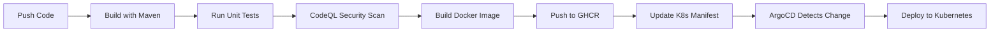

# Complete CI/CD Pipeline Tutorial

A comprehensive step-by-step guide to setting up a production-grade CI/CD pipeline using GitHub Actions, Kubernetes (Kind), and ArgoCD GitOps.

---

## Table of Contents

1. [Introduction](#1-introduction)
2. [Prerequisites Installation](#2-prerequisites-installation)
3. [Understanding the Architecture](#3-understanding-the-architecture)
4. [Setting Up the GitHub Repository](#4-setting-up-the-github-repository)
5. [Creating a Kind Kubernetes Cluster](#5-creating-a-kind-kubernetes-cluster)
6. [Installing and Configuring ArgoCD](#6-installing-and-configuring-argocd)
7. [Configuring GitHub Container Registry (GHCR)](#7-configuring-github-container-registry-ghcr)
8. [Deploying the Application](#8-deploying-the-application)
9. [Testing the CI/CD Pipeline](#9-testing-the-cicd-pipeline)
10. [Troubleshooting](#10-troubleshooting)
11. [Cleanup](#11-cleanup)

---

## 1. Introduction

### What You'll Learn

By the end of this tutorial, you will understand:

- **Kubernetes basics** with Kind (Kubernetes in Docker)
- **GitOps principles** using ArgoCD
- **CI/CD pipelines** with GitHub Actions
- **Container registries** with GitHub Container Registry (GHCR)
- **Infrastructure as Code** with Kustomize

### What We're Building

```
┌─────────────────────────────────────────────────────────────────────────────┐
│                           CI/CD Pipeline Flow                                │
├─────────────────────────────────────────────────────────────────────────────┤
│                                                                             │
│   Developer          GitHub Actions              ArgoCD         Kubernetes  │
│   ─────────          ──────────────              ──────         ──────────  │
│                                                                             │
│   git push  ───────►  Build & Test                                          │
│                           │                                                 │
│                           ▼                                                 │
│                      CodeQL Scan                                            │
│                           │                                                 │
│                           ▼                                                 │
│                    Build Container ─────► Push to GHCR                      │
│                           │                                                 │
│                           ▼                                                 │
│                   Update K8s Manifest                                       │
│                           │                                                 │
│                           └─────────────► Detect Change ───► Deploy to K8s  │
│                                                                             │
└─────────────────────────────────────────────────────────────────────────────┘
```

---

## 2. Prerequisites Installation

### 2.1 Install Docker Desktop

Docker is required to run Kind (Kubernetes in Docker).

**Windows:**
1. Download Docker Desktop from https://www.docker.com/products/docker-desktop/
2. Run the installer
3. Restart your computer when prompted
4. Start Docker Desktop and wait for it to be ready (green icon in system tray)

**Verify installation:**
```powershell
docker --version
# Expected output: Docker version 24.x.x or higher
```

### 2.2 Install Kind

Kind (Kubernetes in Docker) allows you to run Kubernetes clusters locally using Docker containers.

**Windows (PowerShell as Administrator):**
```powershell
# Option 1: Using Chocolatey
choco install kind

# Option 2: Using winget
winget install Kubernetes.kind

# Option 3: Manual download
curl.exe -Lo kind-windows-amd64.exe https://kind.sigs.k8s.io/dl/v0.20.0/kind-windows-amd64
Move-Item .\kind-windows-amd64.exe C:\Windows\System32\kind.exe
```

**Verify installation:**
```powershell
kind --version
# Expected output: kind version 0.20.0 or higher
```

### 2.3 Install kubectl

kubectl is the Kubernetes command-line tool.

**Windows (PowerShell as Administrator):**
```powershell
# Option 1: Using Chocolatey
choco install kubernetes-cli

# Option 2: Using winget
winget install Kubernetes.kubectl

# Option 3: Manual download
curl.exe -LO "https://dl.k8s.io/release/v1.29.0/bin/windows/amd64/kubectl.exe"
Move-Item .\kubectl.exe C:\Windows\System32\kubectl.exe
```

**Verify installation:**
```powershell
kubectl version --client
# Expected output: Client Version: v1.29.0 or higher
```

### 2.4 Install Git

**Windows:**
```powershell
winget install Git.Git
```

**Verify installation:**
```powershell
git --version
# Expected output: git version 2.x.x
```

### 2.5 Verify All Prerequisites

Run this command to verify everything is installed:

```powershell
Write-Host "Checking prerequisites..." -ForegroundColor Cyan
Write-Host ""

# Docker
$docker = docker --version 2>$null
if ($docker) { Write-Host "✓ Docker: $docker" -ForegroundColor Green }
else { Write-Host "✗ Docker: Not installed" -ForegroundColor Red }

# Kind
$kind = kind --version 2>$null
if ($kind) { Write-Host "✓ Kind: $kind" -ForegroundColor Green }
else { Write-Host "✗ Kind: Not installed" -ForegroundColor Red }

# kubectl
$kubectl = kubectl version --client --short 2>$null
if ($kubectl) { Write-Host "✓ kubectl: $kubectl" -ForegroundColor Green }
else { Write-Host "✗ kubectl: Not installed" -ForegroundColor Red }

# Git
$git = git --version 2>$null
if ($git) { Write-Host "✓ Git: $git" -ForegroundColor Green }
else { Write-Host "✗ Git: Not installed" -ForegroundColor Red }
```

---

## 3. Understanding the Architecture

### 3.1 Key Components

| Component | Purpose | Location |
|-----------|---------|----------|
| **GitHub Actions** | CI/CD automation | `.github/workflows/` |
| **Kind** | Local Kubernetes cluster | Docker containers |
| **ArgoCD** | GitOps deployment | Kubernetes cluster |
| **GHCR** | Container image registry | GitHub |
| **Kustomize** | K8s manifest management | `k8s/base/` |

### 3.2 Directory Structure

```
task-manager/
├── .github/
│   └── workflows/
│       └── ci.yml              # CI/CD pipeline definition
├── argocd/
│   └── application.yaml        # ArgoCD Application manifest
├── k8s/
│   └── base/
│       ├── kustomization.yaml  # Kustomize configuration
│       ├── namespace.yaml      # Kubernetes namespace
│       ├── deployment.yaml     # Application deployment
│       ├── service.yaml        # Application service
│       ├── configmap.yaml      # Configuration
│       ├── secret.yaml         # Secrets (template)
│       ├── postgres-deployment.yaml
│       └── postgres-service.yaml
├── scripts/
│   ├── setup-cluster.ps1       # Windows setup script
│   └── setup-cluster.sh        # Linux/Mac setup script
├── src/                        # Application source code
├── Dockerfile                  # Container image definition
├── kind-config.yaml            # Kind cluster configuration
└── pom.xml                     # Maven build configuration
```

### 3.3 Pipeline Stages Explained



| Stage | Description |
|-------|-------------|
| **Build** | Compiles Java code using Maven |
| **Test** | Runs JUnit/Mockito unit tests |
| **CodeQL** | Scans for security vulnerabilities |
| **Container** | Builds Docker image with Dockerfile |
| **Push** | Uploads image to GitHub Container Registry |
| **Update Manifest** | Updates K8s manifest with new image tag |
| **ArgoCD Sync** | Automatically deploys updated manifest |

---

## 4. Setting Up the GitHub Repository

### 4.1 Create a GitHub Repository

1. Go to https://github.com/new
2. Create a new repository named `task-manager` (or your preferred name)
3. Keep it **public** (for free GHCR access) or **private**
4. Don't initialize with README (we already have one)

### 4.2 Configure Repository Secrets

For the CI/CD pipeline to push to GHCR, you need to configure permissions:

1. Go to your repository → **Settings** → **Actions** → **General**
2. Scroll to **Workflow permissions**
3. Select **Read and write permissions**
4. Check **Allow GitHub Actions to create and approve pull requests**
5. Click **Save**

### 4.3 Push Code to GitHub

```powershell
# Navigate to project directory
cd c:\Users\MY PC\Desktop\task-manager

# Initialize git (if not already)
git init

# Add remote origin
git remote add origin https://github.com/AaronCallanga/task-manager.git

# Add all files
git add .

# Commit
git commit -m "feat: initial CI/CD pipeline setup"

# Push to main branch
git push -u origin main
```

> **Note:** The first push will trigger the CI/CD pipeline, but it will fail at the container stage until we complete the setup. This is expected!

---

## 5. Creating a Kind Kubernetes Cluster

### 5.1 Understanding kind-config.yaml

Our Kind configuration file (`kind-config.yaml`) defines the cluster:

```yaml
# kind-config.yaml explained
kind: Cluster
apiVersion: kind.x-k8s.io/v1alpha4
name: task-manager-cluster    # Cluster name

nodes:
  - role: control-plane       # Single node cluster
    extraPortMappings:
      # Maps container ports to host ports
      - containerPort: 30080  # Application
        hostPort: 30080
      - containerPort: 30081  # ArgoCD UI
        hostPort: 30081
```

### 5.2 Create the Cluster

```powershell
# Navigate to project directory
cd c:\Users\MY PC\Desktop\task-manager

# Create Kind cluster using our config
kind create cluster --config kind-config.yaml

# Expected output:
# Creating cluster "task-manager-cluster" ...
# ✓ Ensuring node image (kindest/node:v1.27.3) 🖼
# ✓ Preparing nodes 📦
# ✓ Writing configuration 📜
# ✓ Starting control-plane 🕹️
# ✓ Installing CNI 🔌
# ✓ Installing StorageClass 💾
# Set kubectl context to "kind-task-manager-cluster"
```

### 5.3 Verify the Cluster

```powershell
# Check cluster is running
kind get clusters
# Output: task-manager-cluster

# Check kubectl context
kubectl cluster-info
# Output: Kubernetes control plane is running at https://127.0.0.1:xxxxx

# Check node status
kubectl get nodes
# Output: NAME                                STATUS   ROLES           AGE
#         task-manager-cluster-control-plane Ready    control-plane   1m
```

### 5.4 Understanding What Just Happened

When you created the Kind cluster:
1. Docker pulled the `kindest/node` image
2. A Docker container was started simulating a Kubernetes node
3. Kubernetes components were initialized inside the container
4. Port mappings were configured (30080, 30081)
5. kubectl was configured to connect to this cluster

---

## 6. Installing and Configuring ArgoCD

### 6.1 What is ArgoCD?

ArgoCD is a declarative, GitOps continuous delivery tool for Kubernetes. It:
- Monitors your Git repository for changes
- Compares the desired state (Git) with the actual state (cluster)
- Automatically syncs when differences are detected

### 6.2 Install ArgoCD

```powershell
# Create ArgoCD namespace
kubectl create namespace argocd

# Install ArgoCD using official manifests
kubectl apply -n argocd -f https://raw.githubusercontent.com/argoproj/argo-cd/stable/manifests/install.yaml

# Wait for ArgoCD to be ready (this takes 2-3 minutes)
Write-Host "Waiting for ArgoCD to be ready..."
kubectl wait --for=condition=available --timeout=300s deployment/argocd-server -n argocd

# Expected output after waiting:
# deployment.apps/argocd-server condition met
```

### 6.3 Expose ArgoCD UI

By default, ArgoCD is only accessible within the cluster. Let's expose it:

```powershell
# Patch ArgoCD server to use NodePort on port 30081
kubectl patch svc argocd-server -n argocd -p '{\"spec\": {\"type\": \"NodePort\", \"ports\": [{\"port\": 443, \"targetPort\": 8080, \"nodePort\": 30081}]}}'

# Verify the service
kubectl get svc argocd-server -n argocd
# Output should show NodePort with 30081
```

### 6.4 Get ArgoCD Admin Password

```powershell
# Get the initial admin password
$ARGOCD_PASSWORD = kubectl -n argocd get secret argocd-initial-admin-secret -o jsonpath="{.data.password}"
$ARGOCD_PASSWORD = [System.Text.Encoding]::UTF8.GetString([System.Convert]::FromBase64String($ARGOCD_PASSWORD))

Write-Host "ArgoCD Credentials:" -ForegroundColor Green
Write-Host "  URL:      https://localhost:30081"
Write-Host "  Username: admin"
Write-Host "  Password: $ARGOCD_PASSWORD"
```

### 6.5 Access ArgoCD UI

1. Open your browser and go to: **https://localhost:30081**
2. Accept the security warning (self-signed certificate)
3. Login with:
   - Username: `admin`
   - Password: (the password from the previous step)

> **Tip:** Bookmark the password somewhere safe. You can also change it later in the ArgoCD UI.

---

## 7. Configuring GitHub Container Registry (GHCR)

### 7.1 Create a Personal Access Token (PAT)

1. Go to https://github.com/settings/tokens
2. Click **Generate new token (classic)**
3. Give it a descriptive name: `task-manager-ghcr`
4. Select these scopes:
   - `read:packages`
   - `write:packages`
   - `delete:packages`
5. Click **Generate token**
6. **Copy the token immediately** (you won't see it again!)

### 7.2 Create Kubernetes Pull Secret

Replace `YOUR_GITHUB_PAT` with the token you just created:

```powershell
# Create the task-manager namespace
kubectl create namespace task-manager

# Create the GHCR pull secret
kubectl create secret docker-registry ghcr-secret `
  --docker-server=ghcr.io `
  --docker-username=AaronCallanga `
  --docker-password=YOUR_GITHUB_PAT `
  -n task-manager

# Verify the secret was created
kubectl get secrets -n task-manager
# Output should include: ghcr-secret
```

### 7.3 Understanding the Secret

This secret allows Kubernetes to pull private images from GHCR. The deployment manifest references it:

```yaml
# In deployment.yaml
spec:
  template:
    spec:
      imagePullSecrets:
        - name: ghcr-secret  # References our secret
```

---

## 8. Deploying the Application

### 8.1 Create the ArgoCD Application

```powershell
# Apply the ArgoCD Application manifest
kubectl apply -f argocd/application.yaml

# Verify it was created
kubectl get applications -n argocd
# Output: NAME           SYNC STATUS   HEALTH STATUS
#         task-manager   OutOfSync     Missing
```

### 8.2 Understanding the ArgoCD Application

Let's examine `argocd/application.yaml`:

```yaml
apiVersion: argoproj.io/v1alpha1
kind: Application
metadata:
  name: task-manager
  namespace: argocd
spec:
  project: default
  
  source:
    repoURL: https://github.com/AaronCallanga/task-manager.git
    targetRevision: main        # Git branch to watch
    path: k8s/base              # Path to K8s manifests
  
  destination:
    server: https://kubernetes.default.svc  # Deploy to this cluster
    namespace: task-manager
  
  syncPolicy:
    automated:
      prune: true               # Delete resources not in Git
      selfHeal: true            # Revert manual changes
```

### 8.3 Trigger a Sync

The first sync might fail because the image doesn't exist yet in GHCR. Let's manually sync after the first CI/CD run:

```powershell
# Option 1: Force sync using kubectl
kubectl patch application task-manager -n argocd --type merge -p '{"operation": {"initiatedBy": {"username": "admin"}, "sync": {}}}'

# Option 2: Sync from ArgoCD UI
# 1. Go to https://localhost:30081
# 2. Click on "task-manager" application
# 3. Click "SYNC" button
```

---

## 9. Testing the CI/CD Pipeline

### 9.1 Understanding the CI Workflow

The pipeline (`.github/workflows/ci.yml`) has these jobs:

| Job | Purpose | Runs On |
|-----|---------|---------|
| `build` | Compile and test | Every push/PR |
| `codeql` | Security scanning | After build |
| `container` | Build and push image | Only on main branch |
| `update-manifest` | Update K8s manifest | After container push |

### 9.2 Trigger the Pipeline

Make a small change and push:

```powershell
# Make a small change
Add-Content -Path README.md -Value "`n<!-- Trigger CI/CD $(Get-Date) -->"

# Commit and push
git add .
git commit -m "test: trigger CI/CD pipeline"
git push
```

### 9.3 Monitor the Pipeline

1. Go to your GitHub repository
2. Click on **Actions** tab
3. You'll see a workflow running
4. Click on it to see detailed logs

### 9.4 Verify Deployment

After the pipeline completes successfully:

```powershell
# Check ArgoCD application status
kubectl get applications -n argocd
# Should show: Synced, Healthy

# Check pods
kubectl get pods -n task-manager
# Should show: task-manager-xxx Running, postgres-xxx Running

# Check services
kubectl get svc -n task-manager

# Test the API
Invoke-RestMethod -Uri "http://localhost:30080/api/tasks" -Method Get
# Expected: Empty array [] or list of tasks
```

### 9.5 Create a Test Task

```powershell
# Create a task via API
$body = @{
    title = "My First Task"
    description = "Created via CI/CD pipeline!"
    priority = "HIGH"
} | ConvertTo-Json

Invoke-RestMethod -Uri "http://localhost:30080/api/tasks" -Method Post -Body $body -ContentType "application/json"

# Verify it was created
Invoke-RestMethod -Uri "http://localhost:30080/api/tasks" -Method Get
```

---

## 10. Troubleshooting

### 10.1 Common Issues

**Issue: Pod stuck in `ImagePullBackOff`**
```powershell
# Check the error
kubectl describe pod -n task-manager -l app=task-manager

# Usually means GHCR secret is wrong or image doesn't exist
# Fix: Recreate the secret or wait for CI/CD to push image
```

**Issue: ArgoCD shows `OutOfSync`**
```powershell
# Check sync status
kubectl get applications -n argocd -o wide

# Force refresh
kubectl patch application task-manager -n argocd --type merge -p '{"metadata": {"annotations": {"argocd.argoproj.io/refresh": "hard"}}}'
```

**Issue: CI/CD fails at container push**
- Check GitHub Actions workflow permissions
- Ensure the repository allows write access to packages
- Go to Settings → Actions → General → Workflow permissions

**Issue: Port 30080 not working**
```powershell
# Check service configuration
kubectl get svc -n task-manager

# Check if there's a pod running
kubectl get pods -n task-manager

# Check pod logs
kubectl logs -l app=task-manager -n task-manager
```

### 10.2 Useful Debug Commands

```powershell
# View pod logs
kubectl logs -f deployment/task-manager -n task-manager

# View pod events
kubectl describe pod -n task-manager -l app=task-manager

# View ArgoCD logs
kubectl logs -f deployment/argocd-server -n argocd

# Get all resources in namespace
kubectl get all -n task-manager

# Check ArgoCD application details
kubectl describe application task-manager -n argocd
```

---

## 11. Cleanup

### 11.1 Delete the Kind Cluster

```powershell
# Delete the entire cluster
kind delete cluster --name task-manager-cluster

# Verify it's deleted
kind get clusters
# Should not list task-manager-cluster
```

### 11.2 Clean Up Docker Resources (Optional)

```powershell
# Remove unused Docker images
docker system prune -a

# Remove Kind images specifically
docker rmi $(docker images | grep kindest | awk '{print $3}')
```

---

## Conclusion

Congratulations! 🎉 You've successfully set up a complete CI/CD pipeline with:

- ✅ **GitHub Actions** for automated builds and tests
- ✅ **CodeQL** for security scanning
- ✅ **GHCR** for container image storage
- ✅ **Kind** for local Kubernetes
- ✅ **ArgoCD** for GitOps deployment

### What's Next?

- Add more test cases
- Implement database migrations
- Add monitoring with Prometheus/Grafana
- Set up staging/production environments
- Implement canary deployments

---

## Quick Reference

| Resource | URL |
|----------|-----|
| Application API | http://localhost:30080/api/tasks |
| ArgoCD UI | https://localhost:30081 |
| GitHub Actions | https://github.com/AaronCallanga/task-manager/actions |
| GHCR Packages | https://github.com/AaronCallanga?tab=packages |

| Command | Purpose |
|---------|---------|
| `kind get clusters` | List Kind clusters |
| `kubectl get pods -n task-manager` | List application pods |
| `kubectl get applications -n argocd` | List ArgoCD applications |
| `kubectl logs -f deployment/task-manager -n task-manager` | View app logs |
| `kind delete cluster --name task-manager-cluster` | Delete cluster |
