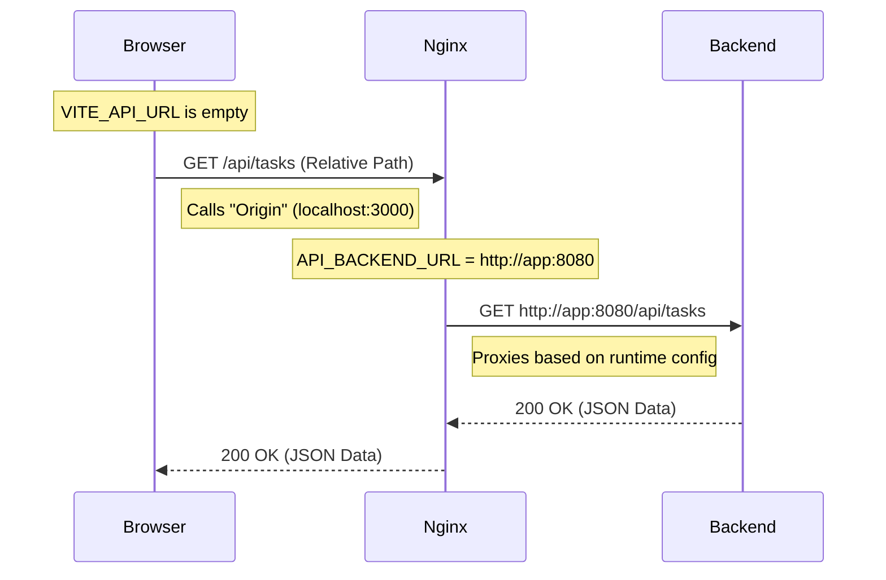

# API Resolution Flow Explained

This document details exactly how the TickTask application resolves API URLs across different stages (Client, Server, Network) and why `VITE_API_URL` is empty in our container setup.

---

## The "Disconnect" Concept

It works because the frontend and the Nginx proxy interpret the URL differently at different stages. The React app (Client) and Nginx (Server) are "disconnected" in how they view the API URL.

### 1. Browser Stage (Client-Side)

**Configuration:** `VITE_API_URL=""` (Empty)

When `VITE_API_URL` is empty, Axios creates requests with a **relative path**.

*   **Action:** Code calls `axios.get('/api/tasks')`.
*   **Browser Interpretation:** "This is a relative path. I will send it to the **same origin** that served me this page."
*   **Example:**
    *   If you loaded the page from `http://localhost:3000`...
    *   The browser sends the API request to `http://localhost:3000/api/tasks`.

**Key Takeaway:** The React application is **completely unaware** of the actual backend URL. It just talks to Nginx.

### 2. Nginx Stage (Proxy-Side)

**Configuration:** `API_BACKEND_URL="http://app:8080"` (Runtime Environment Variable)

Nginx acts as the "middleman." It receives the request on port 3000 (mapped to container port 80).

*   **The Rule:** Nginx has a configured location block:
    ```nginx
    location /api/ {
        proxy_pass http://app:8080/api/;
    }
    ```
*   **The Injection:** This configuration was generated at **container startup** by the `docker-entrypoint.sh` script, which injected the value of `API_BACKEND_URL`.
*   **Action:** Nginx forwards the request to `http://app:8080/api/tasks`.

### 3. Network Stage (DNS Resolution)

**Configuration:** Docker Network / Kubernetes Cluster DNS

Once Nginx tries to connect to `http://app:8080`, the network layer takes over.

*   **Docker Compose:**
    *   Docker's internal DNS sees the hostname `app`.
    *   It resolves it to the internal IP address of the backend container (e.g., `172.18.0.3`).
*   **Kubernetes:**
    *   Cluster DNS sees the Service name (e.g., `ticktask-api-service`).
    *   It resolves it to the ClusterIP of the service.

---

## Visual Summary



## Why This Approach?

| Feature | direct `VITE_API_URL` | Nginx Proxy (Current) |
| :--- | :--- | :--- |
| **Connection Type** | Direct (Browser -> Backend) | Proxied (Browser -> Nginx -> Backend) |
| **CORS** | Required (Cross-Origin) | **Not Required** (Same-Origin) |
| **Configuration Time** | **Build Time** (Hardcoded) | **Runtime** (Flexible) |
| **Portability** | Rebuild needed for each env | one Docker image for all envs |

This setup allows us to build the Docker image **once** and deploy it anywhere (Dev, Test, Prod, K8s) just by changing the `API_BACKEND_URL` environment variable.
